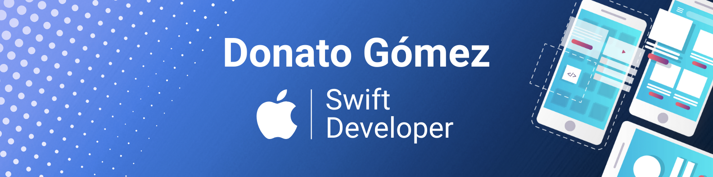

<p align="center">
  
</p>

<p align="center">
  
  
  
  
  
  
  
  
  
  
  
  
  
</p>

Apple platforms developer focused on building production-grade SwiftUI apps with clean architecture and real-world constraints.
I ship features end-to-end: API integration, persistence, CarPlay, TestFlight and App Store delivery.

<p align="center">
  <a href="https://donatogomez.dev">Website</a> •
  <a href="https://www.linkedin.com/in/donatogomez/">LinkedIn</a> •
  <a href="https://github.com/donatogomez">GitHub</a> •
  <a href="https://medium.com/@donatogomez88">Medium</a>
</p>

## 🚀 What I build

I specialize in native Apple apps using modern Swift (Swift 6 + SwiftUI), with a strong focus on:

- Clean Architecture & MVVM
- Unidirectional data flow
- Async/Await & Actors (strict concurrency)
- SwiftData persistence
- Audio streaming & CarPlay
- End-to-end delivery (Xcode Cloud, TestFlight)

## 📱 Apps

**🎵 Zona Salsa Radio** — Official app of the ZonaSalsa station. Live 24/7 salsa streaming with CarPlay, Lock Screen & Control Center, real-time now-playing, song history and light/dark themes. Built with Swift 6 + SwiftUI and AVPlayer/AVFoundation.

<a href="https://apps.apple.com/us/app/zonasalsa/id6759666915">
  
</a>

**🥁 Bachata Rhythm** — Educational rhythm-training app: 7 instruments, 5 sections, BPM control, AVFoundation audio engine, VoiceOver support and bilingual UI.


**🧠 Quizly** — Native iOS app to import quizzes from multiple formats (JSON, Markdown), store them locally and solve them offline through dynamic, reproducible sessions. Strict layered architecture with unidirectional dependencies, zero third-party dependencies, actor-based file I/O, schema migrations and a deterministic session engine. Swift 6 · SwiftUI · async/await + actors · Codable · XCTest.

<a href="https://github.com/donatogomez/quizly">
  
</a>

## ⚙️ Engineering notes — Zona Salsa Radio

A small, native, privacy-first app (no data collection, ~3.6 MB) with more going on under the hood than a typical radio player:

- **Live streaming** with `AVPlayer` over a remote audio stream, with a configured `AVAudioSession` (`.playback`) for uninterrupted background audio.
- **Lock Screen & Control Center** integration via `MPNowPlayingInfoCenter` and `MPRemoteCommandCenter`, keeping play/pause and metadata in sync with playback state.
- **CarPlay** support so the stream is controllable from the car.
- **Real-time now-playing** (artist / song / album) and song history.
- **Theming** (light / dark / automatic) and social sharing with per-destination flows (Instagram & Facebook Stories vs. generic share).
- **Architecture**: Clean Architecture + MVVM with unidirectional data flow; concurrency handled with `async/await` and actors.
- **Delivery**: shipped and maintained through Xcode Cloud → TestFlight → App Store.

> _Note: adjust the metadata source (ICY stream metadata vs. API polling) and any specifics to match the real implementation before publishing._

## ✍️ Writing

I write about modern Swift on [Medium](https://medium.com/@donatogomez88) — Swift 6, strict concurrency and SwiftUI architecture.

- [Reactive Swift Without Combine or Rx](https://medium.com/@donatogomez88/reactive-swift-without-combine-or-rx-a35a5ba31e08)
- [Understanding @MainActor in SwiftUI: A Practical Guide for Swift 6](https://medium.com/@donatogomez88/understanding-mainactor-in-swiftui-a-practical-guide-for-swift-6-69e657872ec5)
- [Swift Beyond the Apple Ecosystem: An Underused Language](https://medium.com/@donatogomez88/swift-beyond-the-apple-ecosystem-an-underused-language-b5f712ca0c90)

## 🧠 Developer Profile

```swift
struct DeveloperProfile {
    let name = "Donato Gómez"
    let role = "Apple Platforms Developer"

    let platforms = ["iOS", "iPadOS"]

    let architecture = [
        "MVVM",
        "Clean Architecture",
        "Unidirectional Data Flow"
    ]

    let coreTechnologies = [
        "SwiftUI",
        "SwiftData",
        "Async/Await",
        "Actors",
        "URLSession",
        "DocC",
        "Swift Testing"
    ]

    let principles = [
        "Clean Code",
        "Modular Architecture",
        "Performance Optimization",
        "Human-centered UI/UX",
        "Accessibility by default",
        "Developer Experience"
    ]

    let goals = [
        "Build maintainable Apple platform apps",
        "Apply Swift 6 strict concurrency in real products",
        "Ship production features end-to-end",
        "Grow through building, teaching and mentoring"
    ]
}
```

## 🧰 Core Stack

Swift 6 • SwiftUI • SwiftData • Async/Await • Actors • Xcode • Git • TestFlight

## 📈 GitHub Activity

<p align="center">
  
</p>
